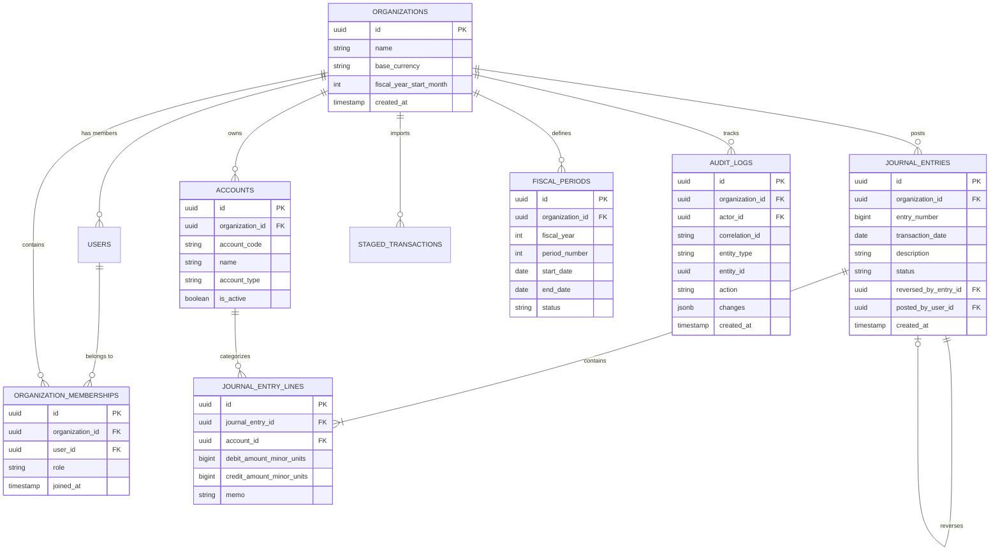

# Data Model Specification

## 1. Overview & Multi-Tenant Pattern
FinIntel employs a single-database, shared-schema multi-tenant model. Every core business domain table MUST include an `organization_id` UUID column indexed with foreign key constraint referencing `organizations(id)`.

---

## 2. Entity-Relationship Diagram (ERD)

---

## 3. Core Entity Definitions

### 3.1 `organizations`
- `id` (`UUID`, Primary Key)
- `name` (`VARCHAR(255)`, Not Null)
- `base_currency` (`VARCHAR(3)`, Not Null, e.g. `USD`)
- `fiscal_year_start_month` (`INT`, Default `1`)
- `created_at` (`TIMESTAMPTZ`, Not Null)

### 3.2 `accounts` (Chart of Accounts)
- `id` (`UUID`, Primary Key)
- `organization_id` (`UUID`, Foreign Key, Indexed)
- `account_code` (`VARCHAR(50)`, Not Null, Unique per org)
- `name` (`VARCHAR(255)`, Not Null)
- `account_type` (`VARCHAR(50)`, Enum: `ASSET`, `LIABILITY`, `EQUITY`, `REVENUE`, `EXPENSE`)
- `is_active` (`BOOLEAN`, Default `true`)

### 3.3 `journal_entries`
- `id` (`UUID`, Primary Key)
- `organization_id` (`UUID`, Foreign Key, Indexed)
- `entry_number` (`BIGINT`, Monotonically increasing per org)
- `transaction_date` (`DATE`, Not Null)
- `description` (`TEXT`, Not Null)
- `status` (`VARCHAR(20)`, Enum: `DRAFT`, `POSTED`)
- `reversed_by_entry_id` (`UUID`, Foreign Key nullable, references `journal_entries.id`)
- `posted_by_user_id` (`UUID`, Foreign Key, references `users.id`)

### 3.4 `journal_entry_lines`
- `id` (`UUID`, Primary Key)
- `journal_entry_id` (`UUID`, Foreign Key, Indexed)
- `account_id` (`UUID`, Foreign Key, Indexed)
- `debit_amount_minor_units` (`BIGINT`, Default 0)
- `credit_amount_minor_units` (`BIGINT`, Default 0)
- `memo` (`TEXT`)

### 3.5 `fiscal_periods`
- `id` (`UUID`, Primary Key)
- `organization_id` (`UUID`, Foreign Key, Indexed)
- `fiscal_year` (`INT`, Not Null)
- `period_number` (`INT`, Not Null, 1-12)
- `start_date` (`DATE`, Not Null)
- `end_date` (`DATE`, Not Null)
- `status` (`VARCHAR(20)`, Enum: `OPEN`, `CLOSED`, `LOCKED`)

### 3.6 `audit_logs`
- `id` (`UUID`, Primary Key)
- `organization_id` (`UUID`, Foreign Key, Indexed)
- `actor_id` (`UUID`, Foreign Key)
- `correlation_id` (`VARCHAR(64)`, Not Null, Indexed)
- `entity_type` (`VARCHAR(100)`, Not Null)
- `entity_id` (`UUID`, Not Null)
- `action` (`VARCHAR(50)`, Enum: `CREATE`, `UPDATE`, `POST`, `REVERSE`, `DELETE`, `LOCK`)
- `changes` (`JSONB`, Detailed before/after delta)
- `created_at` (`TIMESTAMPTZ`, Not Null)
