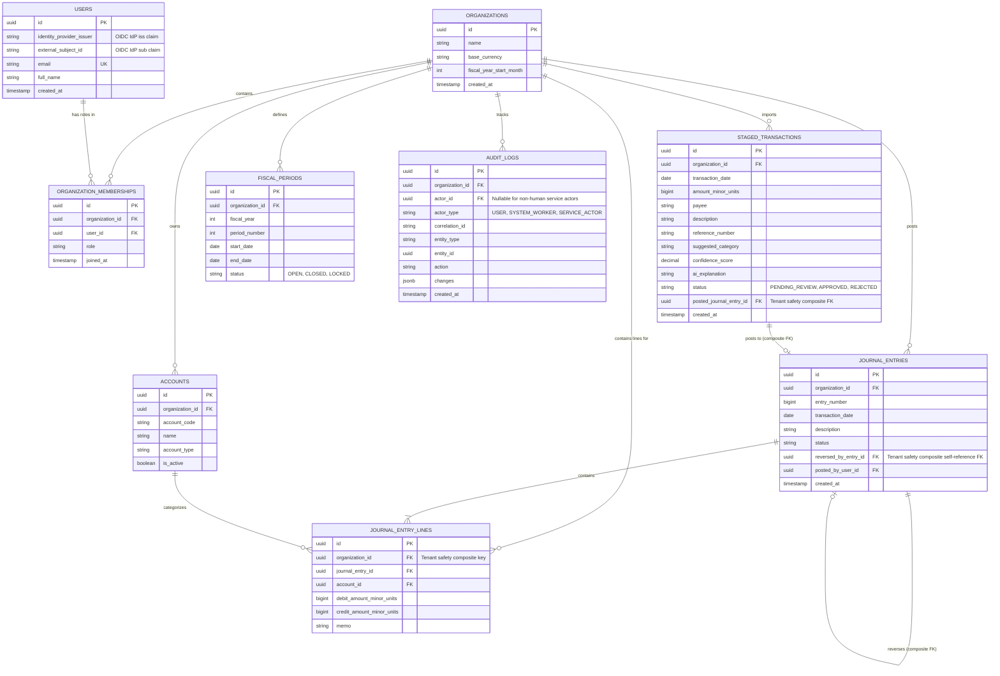

# Data Model Specification

## 1. Overview & Multi-Tenant Isolation Pattern
FinIntel employs a single-database, shared-schema multi-tenant model. Multi-tenant isolation is enforced at the database layer through composite primary/foreign keys and PostgreSQL Row-Level Security (RLS):

1. Every business entity table MUST contain an `organization_id UUID NOT NULL` column referencing `organizations(id)`.
2. All foreign key constraints between tenant-scoped entities MUST use composite foreign key definitions matching `(organization_id, referenced_entity_id)` against `(organization_id, id)` on the target table. All referenced tenant tables MUST define explicit `UNIQUE (organization_id, id)` constraints to support these target keys. This guarantees that an entity in Tenant A can NEVER reference an account, entry, or staged transaction belonging to Tenant B at the database schema level.
3. PostgreSQL Row-Level Security (RLS) is enabled on all tenant-scoped tables as defense-in-depth. RLS policies supplement mandatory application-level query filtering (`WHERE organization_id = $1`). Tenant policies fail closed by default if organization session context is missing or mismatched.
4. The production application database connection role MUST NOT be a superuser, table owner, or possess `BYPASSRLS` privileges. Automated cross-tenant RLS integration tests are mandatory in the test suite.

---

## 2. Entity-Relationship Diagram (ERD)



---

## 3. Core Entity Definitions

### 3.1 `organizations`
- `id` (`UUID`, Primary Key)
- `name` (`VARCHAR(255)`, Not Null)
- `base_currency` (`VARCHAR(3)`, Not Null, e.g. `USD`)
- `fiscal_year_start_month` (`INT`, Default `1`)
- `created_at` (`TIMESTAMPTZ`, Not Null)
- Unique composite key for foreign keys: `(id)` and `UNIQUE (id)`

### 3.2 `users` (Application Profiles)
- `id` (`UUID`, Primary Key)
- `identity_provider_issuer` (`VARCHAR(255)`, Not Null - Maps to OIDC IdP `iss` claim, e.g. `https://auth.finintel.io/`)
- `external_subject_id` (`VARCHAR(255)`, Not Null - Maps to OIDC IdP `sub` claim)
- `email` (`VARCHAR(255)`, Unique, Not Null)
- `full_name` (`VARCHAR(255)`, Not Null)
- `created_at` (`TIMESTAMPTZ`, Not Null)
- **Identity Uniqueness Constraint**: `UNIQUE (identity_provider_issuer, external_subject_id)` to uniquely identify user profiles by issuer plus subject across multi-provider and enterprise federation setups.
- *Note*: Passwords, password hashes, and MFA secrets are NOT stored in PostgreSQL.

### 3.3 `organization_memberships`
- `id` (`UUID`, Primary Key)
- `organization_id` (`UUID`, Foreign Key, references `organizations(id)`)
- `user_id` (`UUID`, Foreign Key, references `users(id)`)
- `role` (`VARCHAR(50)`, Enum: `OWNER`, `ADMINISTRATOR`, `ACCOUNTANT`, `ANALYST`, `AUDITOR_VIEWER`)
- `joined_at` (`TIMESTAMPTZ`, Not Null)
- Unique constraint: `(organization_id, user_id)`

### 3.4 `accounts` (Chart of Accounts)
- `id` (`UUID`, Primary Key)
- `organization_id` (`UUID`, Foreign Key, Indexed)
- `account_code` (`VARCHAR(50)`, Not Null)
- `name` (`VARCHAR(255)`, Not Null)
- `account_type` (`VARCHAR(50)`, Enum: `ASSET`, `LIABILITY`, `EQUITY`, `REVENUE`, `EXPENSE`)
- `is_active` (`BOOLEAN`, Default `true`)
- Unique composite constraint: `(organization_id, account_code)`
- **Tenant-Safe Foreign Key Target Constraint**: `UNIQUE (organization_id, id)`

### 3.5 `journal_entries`
- `id` (`UUID`, Primary Key)
- `organization_id` (`UUID`, Foreign Key, Indexed)
- `entry_number` (`BIGINT`, Monotonically increasing per org)
- `transaction_date` (`DATE`, Not Null)
- `description` (`TEXT`, Not Null)
- `status` (`VARCHAR(20)`, Enum: `DRAFT`, `POSTED`)
- `reversed_by_entry_id` (`UUID`, Foreign Key nullable)
- `posted_by_user_id` (`UUID`, Foreign Key nullable, references `users(id)`)
- **Tenant-Safe Foreign Key Target Constraint**: `UNIQUE (organization_id, id)`
- **Tenant-Safe Composite Self-Reference Foreign Key**:
  - `FOREIGN KEY (organization_id, reversed_by_entry_id) REFERENCES journal_entries(organization_id, id)`

### 3.6 `journal_entry_lines`
- `id` (`UUID`, Primary Key)
- `organization_id` (`UUID`, Foreign Key, Indexed)
- `journal_entry_id` (`UUID`, Foreign Key)
- `account_id` (`UUID`, Foreign Key)
- `debit_amount_minor_units` (`BIGINT`, Default 0)
- `credit_amount_minor_units` (`BIGINT`, Default 0)
- `memo` (`TEXT`)
- **Tenant-Safe Composite Foreign Keys**:
  - `FOREIGN KEY (organization_id, journal_entry_id) REFERENCES journal_entries(organization_id, id)`
  - `FOREIGN KEY (organization_id, account_id) REFERENCES accounts(organization_id, id)`

### 3.7 `staged_transactions`
- `id` (`UUID`, Primary Key)
- `organization_id` (`UUID`, Foreign Key, Indexed)
- `transaction_date` (`DATE`, Not Null)
- `amount_minor_units` (`BIGINT`, Not Null)
- `payee` (`VARCHAR(255)`)
- `description` (`TEXT`)
- `reference_number` (`VARCHAR(100)`)
- `suggested_category` (`VARCHAR(255)`)
- `confidence_score` (`NUMERIC(5,4)`, e.g., `0.8500`)
- `ai_explanation` (`TEXT`)
- `status` (`VARCHAR(50)`, Enum: `PENDING_REVIEW`, `APPROVED`, `REJECTED`)
- `posted_journal_entry_id` (`UUID`, Foreign Key nullable)
- `created_at` (`TIMESTAMPTZ`, Not Null)
- **Tenant-Safe Foreign Key Target Constraint**: `UNIQUE (organization_id, id)`
- **Tenant-Safe Composite Foreign Key**:
  - `FOREIGN KEY (organization_id, posted_journal_entry_id) REFERENCES journal_entries(organization_id, id)`

### 3.8 `fiscal_periods`
- `id` (`UUID`, Primary Key)
- `organization_id` (`UUID`, Foreign Key, Indexed)
- `fiscal_year` (`INT`, Not Null)
- `period_number` (`INT`, Not Null, 1-12)
- `start_date` (`DATE`, Not Null)
- `end_date` (`DATE`, Not Null)
- `status` (`VARCHAR(20)`, Enum: `OPEN`, `CLOSED`, `LOCKED`)
- Unique composite constraint: `(organization_id, fiscal_year, period_number)`
- **Tenant-Safe Foreign Key Target Constraint**: `UNIQUE (organization_id, id)`

### 3.9 `audit_logs`
- `id` (`UUID`, Primary Key)
- `organization_id` (`UUID`, Foreign Key, Indexed)
- `actor_id` (`UUID`, Foreign Key nullable, references `users(id)`)
- `actor_type` (`VARCHAR(50)`, Enum: `USER`, `SYSTEM_WORKER`, `SERVICE_ACTOR`)
- `correlation_id` (`VARCHAR(64)`, Not Null, Indexed)
- `entity_type` (`VARCHAR(100)`, Not Null)
- `entity_id` (`UUID`, Not Null)
- `action` (`VARCHAR(50)`, Enum: `CREATE`, `UPDATE`, `POST`, `REVERSE`, `DELETE`, `LOCK`)
- `changes` (`JSONB`, Detailed before/after delta)
- `created_at` (`TIMESTAMPTZ`, Not Null)
- **Tenant-Safe Foreign Key Target Constraint**: `UNIQUE (organization_id, id)`
- **Service Actor & Worker Representation**:
  - When mutations are executed by human users, `actor_id` references `users(id)` and `actor_type = 'USER'`.
  - When operations are executed by background service actors or `System Worker` instances (`services/worker`), `actor_id` MAY be NULL or reference a designated system actor profile, while `actor_type` (`SYSTEM_WORKER` / `SERVICE_ACTOR`) and `correlation_id` record the background service key and trace identifier.
  - Non-human service actor log entries MUST NOT weaken audit traceability or non-repudiation requirements.

---

## 4. Atomic Mutation & Audit Invariant
Every financial record mutation (posting a journal entry, reversing an entry, locking a period) and its corresponding `audit_logs` record MUST be written **atomically** within a single PostgreSQL transaction block:

```sql
BEGIN TRANSACTION ISOLATION LEVEL SERIALIZABLE;

-- 1. Insert or update financial domain record
INSERT INTO journal_entries (...) VALUES (...);
INSERT INTO journal_entry_lines (...) VALUES (...);

-- 2. Insert audit trail event in SAME transaction
INSERT INTO audit_logs (organization_id, actor_id, actor_type, correlation_id, entity_type, entity_id, action, changes, created_at)
VALUES (...);

COMMIT;
```
If either the domain mutation or audit log insertion fails, the entire transaction rolls back.
