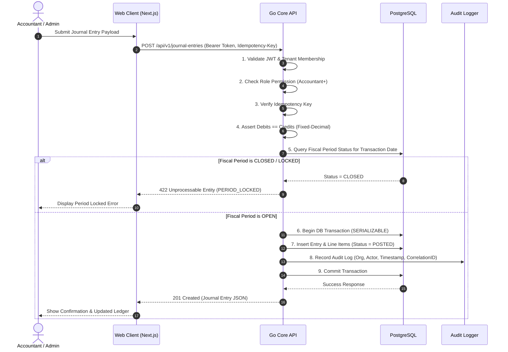

# System Architecture Specification

## 1. Executive Summary
FinIntel is designed as a multi-tenant, modular monolith financial operations platform. It combines a Next.js web application frontend, a Go core REST API engine (`services/api`), a Go background worker (`services/worker`), and a Python advisory intelligence service (`services/intelligence`) backed by PostgreSQL.

---

## 2. High-Level System Architecture (C4 Component Model)

```mermaid
graph TD
    Client["User Browser (Web Client)"] -->|HTTPS / REST API| WebApp["Next.js App Router (apps/web)"]
    WebApp -->|HTTP / JSON API| GoAPI["Go Core API (services/api)"]
    
    subgraph Core Monolith Backend
        GoAPI -->|Auth & Business Rules| Router["chi Router / Middleware"]
        Router -->|RBAC & Tenant Check| Services["Accounting & Domain Services"]
        Services -->|SQL Queries (sqlc/pgx)| Postgres[("PostgreSQL Database")]
        Services -->|Async Tasks| Worker["Go Background Worker (services/worker)"]
    end
    
    subgraph Intelligence Subsystem
        Services -->|Internal HTTP (Read-Only)| PyIntel["Python Intelligence (services/intelligence)"]
        PyIntel -->|Predictions & Anomalies| Services
    end

    classDef client fill:#f9f,stroke:#333,stroke-width:2px;
    classDef core fill:#bbf,stroke:#333,stroke-width:2px;
    classDef db fill:#dfd,stroke:#333,stroke-width:2px;
    classDef intel fill:#ffd,stroke:#333,stroke-width:2px;
    
    class Client client;
    class GoAPI,Router,Services,Worker core;
    class Postgres db;
    class PyIntel intel;
```

---

## 3. Component Responsibilities

### 3.1 Next.js Web Client (`apps/web`)
- User interface built with React, TypeScript, and Tailwind CSS.
- Client-side navigation, form rendering, interactive financial dashboards, and visual review workflows.
- Authenticates against Go API and attaches Bearer JWTs to API calls.

### 3.2 Go Core API (`services/api`)
- Built with `chi` HTTP router, `pgx` driver, and `sqlc` type-safe database queries.
- Owns all business, accounting, validation, and authorization logic.
- Enforces strict tenant isolation on every request (`WHERE organization_id = $1`).
- Enforces accounting invariants: fixed-precision decimal arithmetic, double-entry equality ($\sum \text{Debits} = \sum \text{Credits}$), entry immutability, and period locks.

### 3.3 Go Worker Service (`services/worker`)
- Executes asynchronous, CPU-heavy, or long-running tasks (e.g. batch CSV transaction parsing, financial PDF export rendering, scheduled audit summaries).
- Communicates with PostgreSQL directly under strict tenant scoping.

### 3.4 Python Intelligence Service (`services/intelligence`)
- Built with FastAPI, pandas, scikit-learn, and statsmodels.
- Provides transaction category recommendations, confidence scores, anomaly detection flags, and cash flow projections.
- Purely advisory: CANNOT mutate database state or post journal entries directly.

### 3.5 PostgreSQL Database
- Single persistent source of truth for multi-tenant data, user credentials, chart of accounts, immutable posted journal entries, and audit logs.

---

## 4. Sequence Diagram: Journal Entry Posting Workflow



---

## 5. Security & Isolation Architecture
- All API routes are protected by tenant validation middleware:
  $$\text{Request Context} \longrightarrow \text{Validate JWT} \longrightarrow \text{Verify User Membership in } \text{organization\_id} \longrightarrow \text{Inject Org Context}$$
- DB Connection Pooling uses `pgxpool` with strict statement timeouts and parameter binding to prevent SQL injection.
