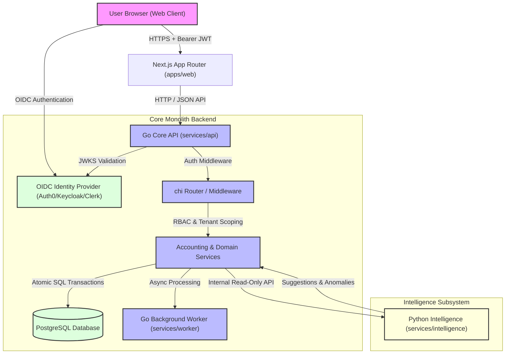
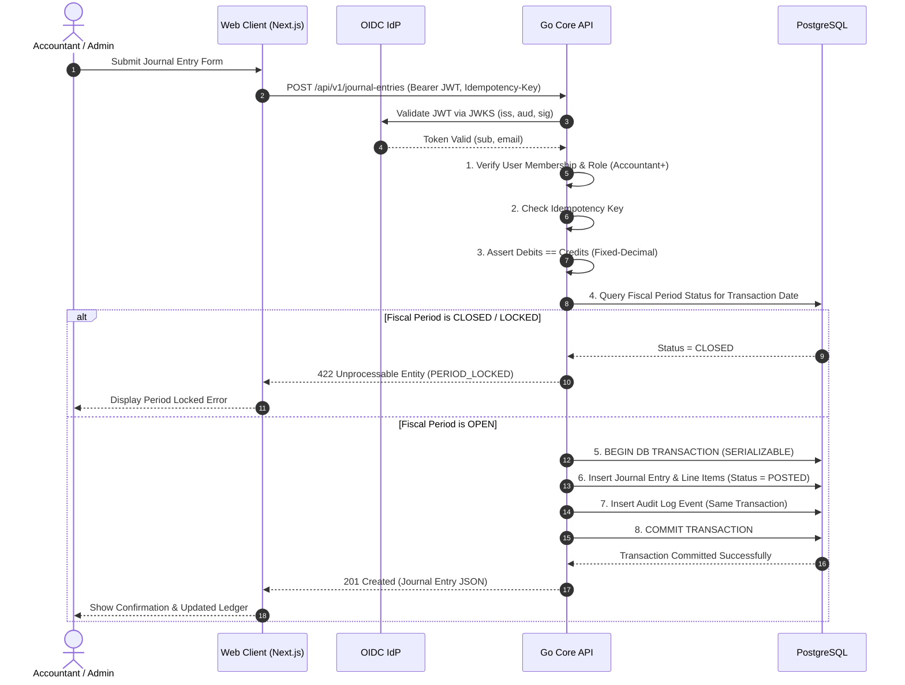

# System Architecture Specification

## 1. Executive Summary
FinIntel is designed as a multi-tenant, modular monolith financial operations platform. It combines a Next.js web application frontend (`apps/web`), a Go core REST API engine (`services/api`), a Go background worker (`services/worker`), and a Python advisory intelligence service (`services/intelligence`) backed by PostgreSQL and an external OIDC Identity Provider.

---

## 2. High-Level System Architecture (C4 Component Model)

---

## 3. Component Responsibilities

### 3.1 OIDC Identity Provider (IdP)
- Manages user credential storage (passwords), multi-factor authentication (MFA), account recovery, and social/enterprise SSO.
- Issues OIDC ID tokens and JWT access tokens containing standard claims (`iss`, `aud`, `sub`, `email`).

### 3.2 Next.js Web Client (`apps/web`)
- User interface built with React, TypeScript, and Tailwind CSS.
- Initiates OIDC login flow with the IdP and attaches Bearer JWT access tokens to Go API requests.

### 3.3 Go Core API (`services/api`)
- Resource server built with Go `chi` router, `pgx` driver, and `sqlc` database queries.
- Validates OIDC JWT signatures via public JWKS endpoints, verifying issuer (`iss`) and audience (`aud`).
- Maps OIDC subject claims (`sub`) to local application user profiles and tenant organization memberships.
- Owns all business, accounting, validation, and authorization logic.
- Enforces strict tenant isolation (`WHERE organization_id = $1`) and accounting invariants: fixed-precision arithmetic, double-entry balance equality ($\sum \text{Debits} = \sum \text{Credits}$), immutability, period locks, and atomic audit logging within single database transactions.

### 3.4 Go Worker Service (`services/worker`)
- Executes asynchronous background tasks (e.g. batch CSV transaction parsing, financial PDF export rendering) under strict tenant scoping.

### 3.5 Python Intelligence Service (`services/intelligence`)
- Built with FastAPI, pandas, scikit-learn, and statsmodels.
- Provides transaction category recommendations, confidence scores, anomaly detection flags, and cash flow projections.
- Purely advisory: CANNOT mutate database state or post journal entries directly. All AI recommendations require explicit human approval by an authorized user (`Accountant` or higher).

### 3.6 PostgreSQL Database
- Single persistent source of truth for multi-tenant data, user profiles, chart of accounts, staged transactions, immutable posted journal entries, and audit logs.
- Stores user profiles mapped to OIDC external subject identifiers (`external_subject_id`). Passwords are NOT stored in PostgreSQL.

---

## 4. Sequence Diagram: Atomic Journal Entry Posting Workflow

---

## 5. Security & Isolation Architecture
- All API routes are protected by tenant validation middleware:
  $$\text{Bearer JWT} \longrightarrow \text{JWKS Verification} \longrightarrow \text{Map } \texttt{sub} \text{ to User} \longrightarrow \text{Assert Org Membership} \longrightarrow \text{Inject Org Context}$$
- DB Connection Pooling uses `pgxpool` with composite tenant foreign keys `(organization_id, id)` to prevent cross-tenant entity referencing at the schema level.
